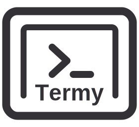
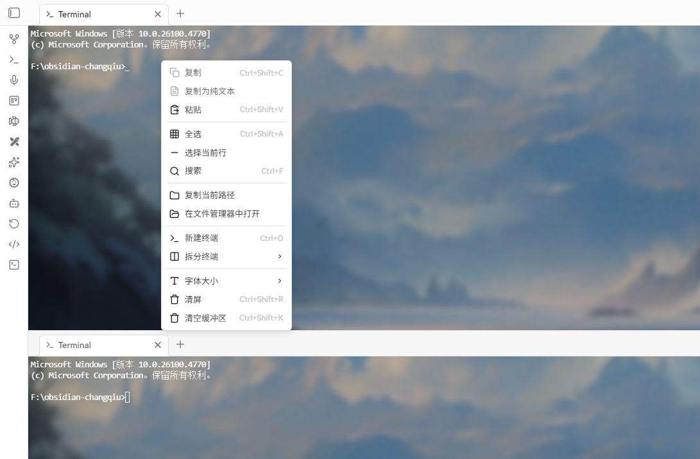
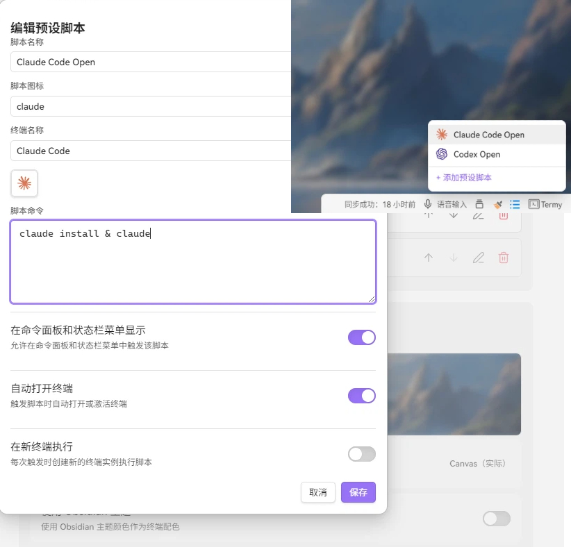

# Termy

*Obsidian 终端模拟器插件*

功能完整的终端模拟器，支持分屏、预设脚本、多 shell 和原生 Rust PTY 后端。

中文版 / [English](./README.md)

## 核心优势（开箱即见）

- **原生后端二进制更精简**：基于 Rust PTY 后端，运行包体更轻量。
- **无需额外第三方运行时依赖**：不需要额外安装桥接服务或外部终端运行环境。
- **启动链路更短、速度更快**：原生后端与插件直连，减少启动开销。
- **面向真实工作流**：分屏、多会话、预设脚本、拖拽粘贴路径能力一体化。

## 功能特性

- **完整终端体验**: 基于 xterm.js，支持 Canvas/WebGL 渲染
- **跨平台支持**: Windows、macOS 和 Linux 均可使用
- **多 Shell 支持**:
  - Windows: cmd、PowerShell、WSL、Git Bash
  - macOS/Linux: bash、zsh、自定义 shell
- **高级功能**:
  - 分屏（水平/垂直）
  - 多终端会话
  - 预设脚本
  - 搜索功能
  - 字体自定义
  - 主题支持（Obsidian 主题或自定义）
  - 多语言支持（英语、中文、日语、韩语、俄语）
  - 背景图片（支持模糊效果）
- **键盘快捷键**:
  - Ctrl+O: 打开终端
  - Ctrl+Shift+R: 清屏
  - Ctrl+Shift+C/V: 复制/粘贴
  - Ctrl+F: 搜索
  - Ctrl+=/−/0: 放大/缩小/重置
  - Ctrl+Shift+H/J: 水平/垂直分屏

## 演示截图

## 安装

> **说明**：插件目前处于审核阶段，尚未上架 Obsidian 社区插件市场。请暂时通过 BRAT 或手动安装。

### 使用 BRAT

1. 先安装 [BRAT](https://github.com/TfTHacker/obsidian42-brat) 插件
2. 打开 BRAT 插件设置，点击 "Add beta plugin"
3. 输入 `ZyphrZero/Termy`
4. 点击 "Add plugin" 完成插件添加
5. 在设置 → 社区插件中启用插件

### 手动安装

1. 从 [GitHub Releases](https://github.com/ZyphrZero/Termy/releases) 下载最新版本
2. 解压到笔记库的 .obsidian/plugins/termy/ 目录
3. 重新加载 Obsidian
4. 在设置 → 社区插件中启用插件

## 许可证

GPL-3.0 许可证 - 详见 [LICENSE](LICENSE)。

## 致谢

- 基于 [xterm.js](https://xterm.js/) 构建
- PTY 后端由 [portable-pty](https://github.com/wez/wezterm/tree/main/pty) 提供支持
- 灵感来自各类终端模拟器和 Obsidian 插件

## 支持

- 问题反馈: [GitHub Issues](https://github.com/ZyphrZero/Termy/issues)
- 讨论: [GitHub Discussions](https://github.com/ZyphrZero/Termy/discussions)
